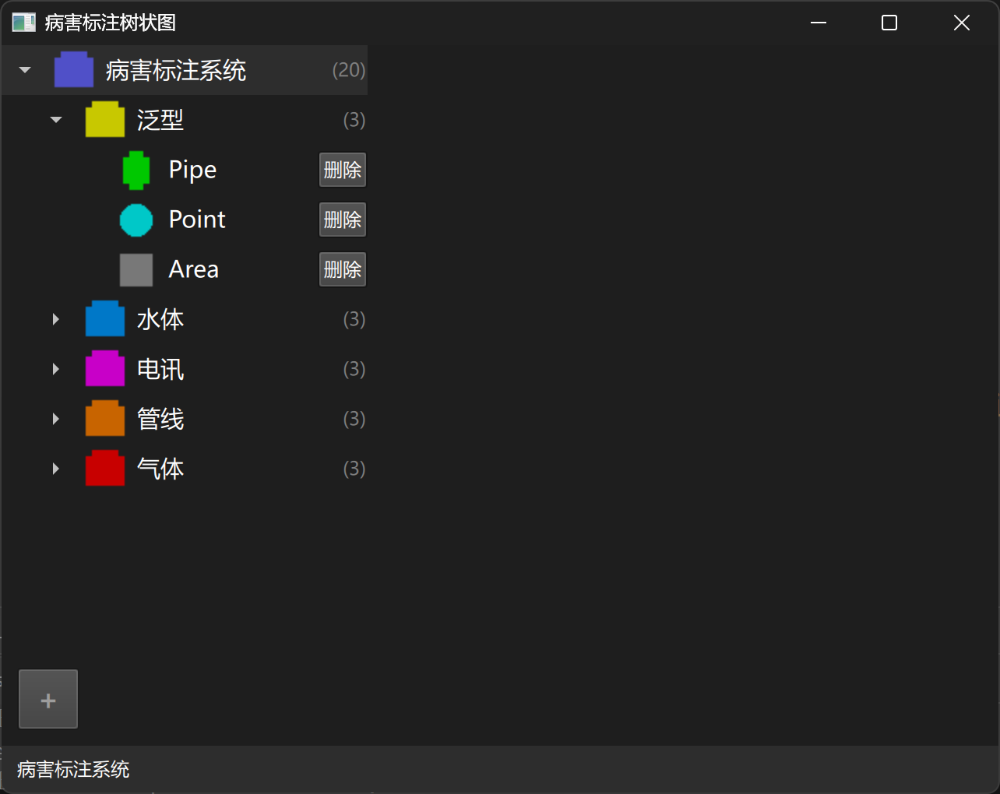

# 地下管网树状图可视化工具 (Utility Tree Visualizer)

一个用于可视化和编辑地下管网结构的Qt/QML应用程序。该应用程序允许用户创建、编辑和可视化管网系统的层次结构，支持不同类型的管网设施（如水、电信、燃气等）。

## 功能特点

- 树状结构可视化管网系统层次关系
- 支持添加和删除节点
- 根据节点类型显示不同的图标
- 显示节点的层级路径
- 支持各种管网类型（水、电信、燃气、管道等）
- 简洁直观的用户界面

## 技术栈

- C++
- Qt 6.5+
- QML
- CMake 构建系统
- Python (仅用于生成图标)

## 系统要求

- Qt 6.5 或更高版本
- C++编译器 (支持C++17或更高版本)
- CMake 3.16 或更高版本

## 构建和运行

### 构建项目

```bash
mkdir build
cd build
cmake ..
cmake --build .
```

### 运行应用程序

在构建完成后，可以通过以下方式运行应用程序：

```bash
# 在build目录中
./appUtilityTreeVisualizer
```

## 项目结构

- `main.cpp` - 应用程序入口
- `Main.qml` - 主QML界面
- `treemodel.cpp/h` - 树结构数据模型
- `treeitem.cpp/h` - 树节点项实现
- `generate_icons.py` - 用于生成节点图标的Python脚本
- `icons/` - 应用程序使用的图标

## 界面



## 使用说明

1. 启动应用程序
2. 使用界面上的工具按钮添加新节点
3. 点击现有节点可以选择它
4. 在节点上右键点击可以删除节点
5. 应用程序会显示选中节点的完整路径

## 开发

### 生成图标

应用程序使用自定义图标表示不同类型的节点。可以使用以下命令重新生成图标：

```bash
python generate_icons.py
```

## 许可证

[添加您的许可证信息] 